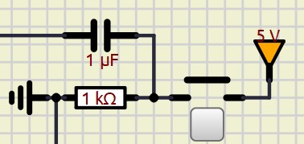
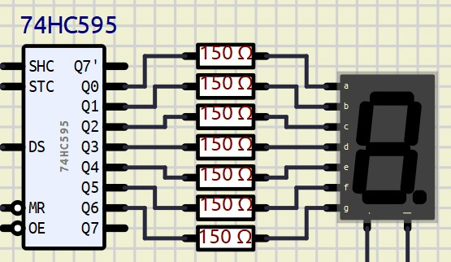

# Simon
Recriado o brinquedo [Simon](https://en.wikipedia.org/wiki/Simon_(game)) utilizando o microcontrolador PIC16F84.

## Descrição

Utilizando o microcontrolador PIC16F84, foi desenvolvido um programa para emular o conceito básico de um Simon, que consiste em repetir a sequência de luzes piscantes apresentadas pelo sistema.

O programa foi desenvolvido em C, utilizando a extensão [MPLAB para Visual Studio Code](https://marketplace.visualstudio.com/items?itemName=Microchip.mplab-extension-pack). Foi seguido os padrões requisitados pelo compilador da mesma.

O circuito foi emulado e desenvolvido no [SimulIDE](https://simulide.com/p/), onde podemos emular vários microcontroladores e componentes eletrônicos.

### Demonstração

[Vídeo no YouTube](https://www.youtube.com/shorts/OvKHHk_A2M8)

Para simular o circuito, é necessário carregar o arquivo *Simon.sim1*, encontrado na pasta */circuito* no *SimulIDE*, e carregar o arquivo *Simon_default_default.hex* encontrado no caminho */_build/Simon/default* como *firmware* no PIC16F84.

### Dificuldades
- **Debounce**

    Quando trabalhamos com entradas por componentes físicos que serão usados por usuários comuns, temos que tratar ruídos, e a técnica de *debounce* trata destes problemas.
    Ela consiste em criar um atraso artificial para termos certeza que o valor lido é verdadeiro e não um ruído. A abordagem escolhida foi de *debounce* físico, por deixar o código mais limpo e, se necessário alterá-lo, só precisamos trocar o componente.

    

    Esse circuito gera um *debounce* de 10ms, que se enquadra em uma quantidade aceitável de tempo, não sendo perceptível o atraso ao usuário.

- **Display de 7 segmentos**

    Para indicar os valores no display de 7 segmentos, foi utilizado um conversor de serial para paralelo; neste caso, o 74HC595 foi escolhido.

    

    A sequência de LEDs do display a ser acesa é passada para o 74HC595 de modo serial, e o mesmo converte os dados para paralelo.
    Em código, a sequência é representada por um Byte onde o dígito menos significativo é ignorado; logo, a relação de bit para led é:
    ```
        bit:   7 6 5 4 3 2 1 0
        Led:   a b c d e f g -
    ```
    Para representarmos a letra 'A', passaríamos o Byte '0b11101110' para a função `to_paralel()` encarregada do 74HC595.

    ```C
        #define DELAY 1

        void to_paralel(char bits){
            unsigned char i;
            for(i = 0; i < 8; i++){
                // Passa por cada bit
                DATA = (bits & (1<<i)) ? 1 : 0;
                // Pulsa o clock
                CLK = 1;
                __delay_ms(DELAY);
                CLK = 0;
                __delay_ms(DELAY);
            }
            // Pulsa o LATCH
            LATCH = 1;
            __delay_ms(DELAY);
            LATCH = 0;
            __delay_ms(DELAY);
        }
    ```
    Para o 74HC595, cada pulso de *clock* (*SHC* no circuito) transfere o valor de DATA (*DS* do circuito) para um *buffer* interno do 74HC595, e quando pulsamos o *latch* (*STC* no circuito) indicamos que a transmissão de dados foi terminada e os dados do *buffer* são passados para as portas *Q0* até *Q7*.

## Requisitos

Os requisitos para o projeto são:
1. SimulIDE;
2. Visual Studio Code;
3. MPLAB Extension (Extensão de Visual Studio Code).

## Possíveis modificações

Após a conclusão do projeto, foram identificadas duas situações que podiam ter sido abordadas de modo diferente.

1.  **Armazenamento da sequência**
    A sequência de LEDs que serão piscados foi armazenada em um array; poderia ter sido armazenada utilizando 1 Byte.
    Onde os bits 3-0 poderiam representar cada LED, ocupando assim menos espaço na memória do microcontrolador.
    Teríamos que alterar a geração das novas sequências e a verificação da sequência do usuário.
2.  **1 pino para todos os LEDs**
    Na configuração atual, cada LED se conecta diretamente com um pino do microcontrolador, onde acabamos com a Porta B dedicada aos LEDs e aos Botões.
    Se utilizássemos um conversor de serial para paralelo, poderíamos dedicar apenas 3 pinos para os LEDs, ou apenas 1 para o *latch* e utilizar o mesmo pino de *DATA* e *clock* já vistos acima.
    Assim, diminuindo o uso de pinos, abrindo a possibilidade para outros componentes e funcionalidades.